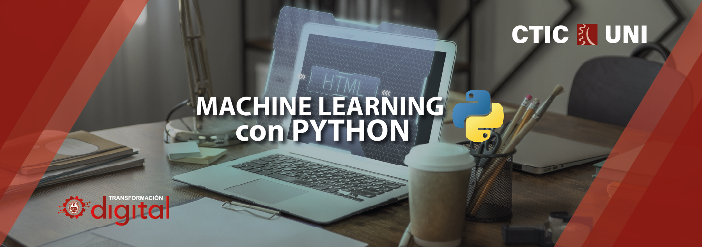

# Machine Learning con Python - OTI - UNI 

El Curso Machine Learning con Python proporciona al participante una
vision amplia de la forma como se debe afrontar un proyecto de
desarrollo de software usando tecnicas de la inteligencia artificial. Al dia
de hoy tanto en sectores academicos como en el sector empresarial
existe mucha necesidad de aprender a utilizar las tecnicas del machine
learning. Es de vital importancia que todo profesional del campo de la
ingenieria sea capas de utilizar los conocimientos impartidos en este
curso en las necesidades que pueda tener en el ambito laboral.

El presente curso busca obtener una vision aplicada de todo lo
concerniente a la aplicación del lenguaje de programacion python en la
obtencion de buenos modelos de machine learning, para ello se centrara
en desarrollar un codigo escalable que permita que el area usuaria del
producto este satisfecha con los resultados.

## Información general 
- *Modalidad virtual*
- *Duración de 6 sesiones*
- *16 horas*

## ¿Qué aprenderas en el curso?
Al finalizar el curso, estarás preparado para utilizar las técnicas del
Machine Learning en proyectos de interés académico y profesional.

## Dirigido a
Este curso está dirigido a alumnos de pregrado de todas las universidades.

## Temario del curso

### Sesión 1.- UNA INTRODUCCIÓN AL MACHINE LEARNING
- *1.- Overview de numpy y matplotli*

### Sesión 2.- MODULOS BASICOS PARA EL MACHINE LEARNING
- *1.- El modulo Pandas*
- *2.- Visualizacion de datos : Matplotlib y Seaborn*

### Sesión 3.- ALGORITMOS DE APRENDIZAJE SUPERVISADO I
- *1.- El modelo de Regresion Lineal*
- *2.- Un modelo lineal generalizado : La regresion Logistica*
- *3.- El barrido de hiperparametros*

### Sesión 4.- ALGORITMOS DE APRENDIZAJE SUPERVISADO II
- *1.- Arboles de decision para problemas de regresion*
- *2.- Arboles de decision para problemas de clasificacion*

### Sesión 5.- ALGORITMOS DE APRENDIZAJE SUPERVISADO III Y ALGORITMOS DE APRENDIZAJE NO SUPERVISADO
- *1.- Bosques Aleatorios*
- *2.- Tecnicas de Clustering*

## Docente 
*Abraham Zamudio Chauca* 

Docente en la Oficina de tecnologías de la información de la
Universidad Nacional de Ingeniería - OTI UNI.

Egresado de la carrera de Matemática de la Universidad
Nacional de Ingeniería con experiencia en la construcción de
sistemas de procesamiento distribuido, despliegue de
soluciones informáticas en entornos Linux y desarrollo de
software usando técnicas de machine learning y deep
learning para entornos comerciales y de investigación.
